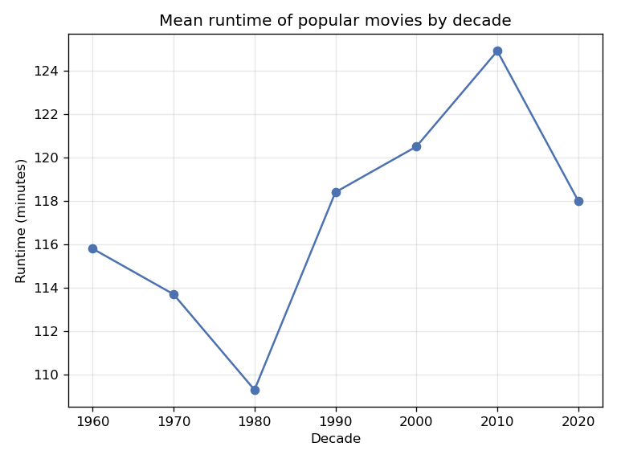
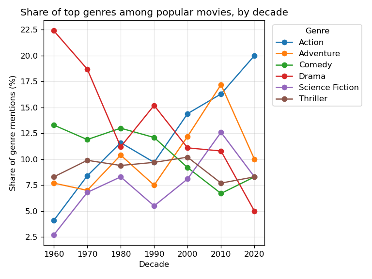
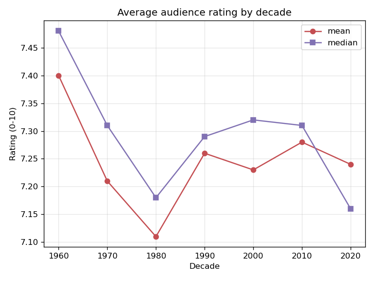

# How Popular Movies Changed, 1960–2020

By gonzalotorrentebelio

We tend to feel that films today are longer, louder, and more dominated by a handful of blockbuster genres than the movies our parents grew up with. Is that impression true? Using the most-voted films of each year from [The Movie Database (TMDB)](https://www.themoviedb.org/), 1,220 films across six decades, I looked at how popular movies changed along three simple dimensions: how long they run, which genres dominate, and how audiences rate them.

The short answer: what changed was what popular films are, not how much people like them. The genre mix flipped from drama to action, runtimes climbed to their longest ever in the 2010s, yet average ratings barely moved across the whole period.

## The data in one line

The analysis covers the 20 most-voted films of each year between 1960 and 2020 — the popular, widely-seen titles of each era rather than everything ever released. All data comes from the TMDB API.

## Finding 1 — Runtime dipped, then climbed to a modern peak

The popular film did not simply get longer — its runtime is U-shaped. Average length fell from 115.8 minutes in the 1960s to a low of 109.3 minutes in the 1980s, then rose for three straight decades to a peak of 124.9 minutes in the 2010s — nearly 16 minutes longer than the 1980s trough. The era of the long blockbuster is a recent development, not a steady century-long trend.

## Finding 2 — The genre mix flipped from drama to action

This is the clearest change in the data. Drama, the dominant genre of the 1960s at around 22% of all genre mentions, collapsed to roughly 5% by the 2020s — a fall of 17.4 points. Action did the opposite, rising from about 4% to 20% (up 15.9 points), with adventure and science fiction climbing alongside it and peaking, tellingly, in the same 2010s that produced the longest films. Popular cinema shifted from character-driven drama toward effects-driven spectacle.

## Finding 3 — Ratings stayed remarkably flat

For all the change in length and genre, audiences' verdict hardly moved. Average ratings stayed inside a narrow 7.11–7.40 band across every decade — a spread of under a third of a point on a 10-point scale. Older decades score *slightly* higher (the 1960s top the list at 7.40), but that is best read as a survivorship effect than as proof of quality: the old films still rated today are mostly the surviving classics, while the era's weaker films have faded from view.

## What it all means

Put the three together and the conclusion is neat: popular movies changed in form, not in favour. They became more spectacle-driven and — since the 1980s — noticeably longer, yet the average viewer's score stayed essentially constant. The blockbuster era reshaped *what* popular cinema looks like far more than *how much* audiences end up enjoying it.

## A note on the data

These are the most-voted films of each year, so they describe popular cinema, not every film made. Ratings were collected today, which means older films are judged in retrospect and mostly by the people who still seek them out. Runtime and financial figures had some unknown values, which were excluded from the averages, and the 2020s rest on a single year (20 films), so that point is read with care.

---

Data source: [The Movie Database (TMDB)](https://www.themoviedb.org/). This product uses the TMDB API but is not endorsed or certified by TMDB. Full code and reproduction steps: [project repository](https://github.com/gonzalotorrentebelio/me204-final-project).
